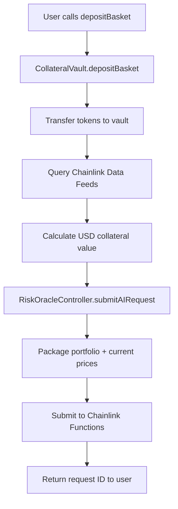
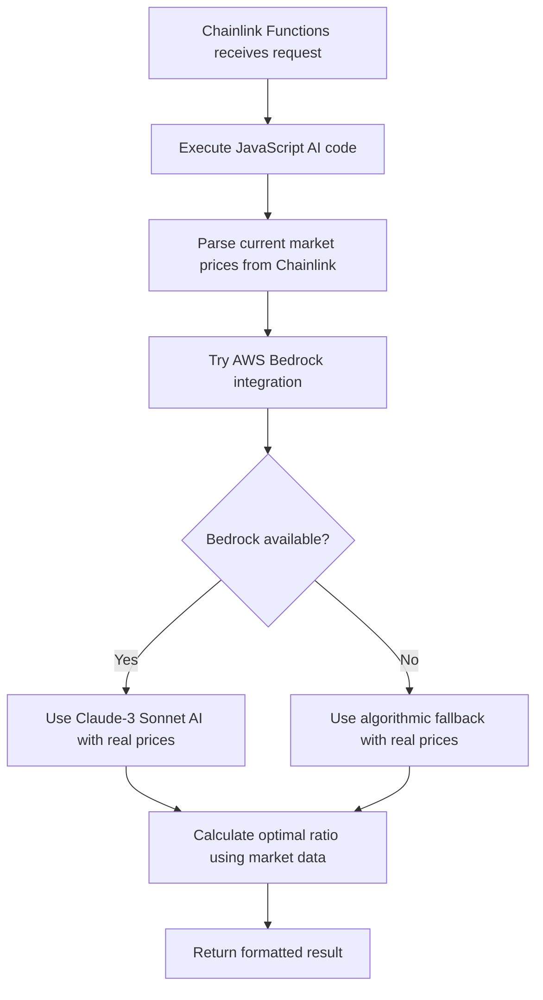
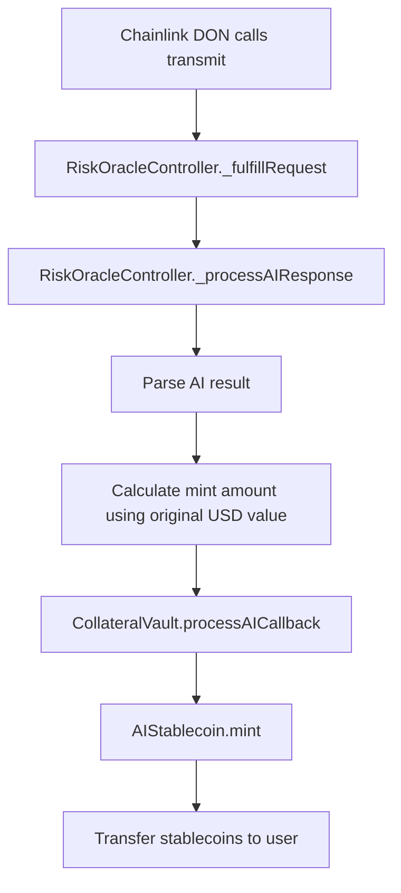

# AI-Powered Stablecoin Transaction Flow

## Overview

This document provides a comprehensive explanation of the complete transaction flow in the AI-powered stablecoin system, from initial deposit to AI-driven minting. The system leverages **dual Chainlink integration** - using both **Chainlink Functions** for sophisticated AI risk assessment and **Chainlink Data Feeds** for real-time price discovery, creating an unprecedented level of automation and accuracy in DeFi.

## Table of Contents

1. [System Architecture](#system-architecture)
2. [Dual Chainlink Integration](#dual-chainlink-integration)
3. [Complete Transaction Flow](#complete-transaction-flow)
4. [Detailed Step-by-Step Analysis](#detailed-step-by-step-analysis)
5. [Event Analysis](#event-analysis)
6. [Real Transaction Example](#real-transaction-example)
7. [Technical Implementation Details](#technical-implementation-details)
8. [Security Considerations](#security-considerations)

## System Architecture

```
User → CollateralVault → RiskOracleController → Chainlink Functions → AI Processing → Callback → Minting
                ↓                    ↑
        Chainlink Data Feeds → Real-time Pricing
```

### Core Contracts

- **AIStablecoin**: ERC20 stablecoin with controlled minting
- **CollateralVault**: Manages user deposits and collateral with Chainlink price integration
- **RiskOracleController**: Interfaces with both Chainlink Functions and Data Feeds
- **Chainlink Functions**: Decentralized off-chain AI computation network
- **Chainlink Data Feeds**: Real-time price oracles for accurate valuations

## Dual Chainlink Integration

### 🔗 **Chainlink Functions Integration**

- **Purpose**: Decentralized AI risk assessment execution
- **Code Size**: 14,006-character sophisticated JavaScript algorithm
- **Execution**: Off-chain computation with on-chain result delivery
- **Features**: AWS Bedrock integration + algorithmic fallback

### 📊 **Chainlink Data Feeds Integration**

- **Purpose**: Real-time price discovery for accurate collateral valuation
- **Supported Assets**: BTC/USD, ETH/USD, LINK/USD, DAI/USD, USDC/USD
- **Safety Features**: Staleness protection, bounds validation, fallback system
- **Update Frequency**: Real-time price updates from Chainlink's decentralized oracle network

### 🎯 **Price Feed Configuration**

```solidity
mapping(string => AggregatorV3Interface) public priceFeeds;

// Configured Chainlink Price Feeds:
// BTC/USD:  Real-time Bitcoin pricing
// ETH/USD:  Real-time Ethereum pricing
// LINK/USD: Real-time Chainlink token pricing
// DAI/USD:  Stablecoin peg monitoring
// USDC/USD: Stablecoin peg monitoring
```

### 💡 **Integration Benefits**

- **Accuracy**: Real-time market prices for precise collateral valuation
- **Decentralization**: No reliance on centralized price APIs
- **Reliability**: Multiple oracle nodes ensure price feed availability
- **Security**: Cryptographically secured price data
- **AI Enhancement**: Current market prices fed directly to AI algorithms

## Complete Transaction Flow

### Phase 1: User Deposit (On-Chain + Chainlink Data Feeds)



### Phase 2: AI Processing (Off-Chain + Real-Time Prices)



### Phase 3: Callback & Minting (On-Chain)



## Detailed Step-by-Step Analysis

### Step 1: User Initiates Deposit + Price Discovery

**Transaction Type**: User-initiated  
**Gas Cost**: ~2.4M gas (~$0.005)  
**Chainlink Integration**: Data Feeds for collateral valuation

```solidity
function depositBasket(address[] memory tokens, uint256[] memory amounts) external {
    // 1. Validate inputs
    // 2. Transfer tokens from user to vault
    // 3. Calculate total collateral value using Chainlink Data Feeds
    uint256 totalValueUSD = 0;
    for (uint256 i = 0; i < tokens.length; i++) {
        // Get real-time price from Chainlink
        int256 price = riskOracleController.getLatestPrice(tokenSymbols[tokens[i]]);
        uint256 tokenValueUSD = (amounts[i] * uint256(price)) / (10 ** (8 + tokenDecimals));
        totalValueUSD += tokenValueUSD;
    }
    // 4. Submit AI request to RiskOracleController
    // 5. Store user position data
}
```

**Key Events Emitted**:

- `Transfer` events for each token
- `DepositInitiated` event with request ID and USD value

### Step 2: AI Request Submission + Current Price Integration

**Function**: `RiskOracleController.submitAIRequest()`  
**Chainlink Integration**: Data Feeds + Functions

```solidity
function submitAIRequest(address user, bytes calldata basketData, uint256 collateralValue)
    external returns (uint256 internalRequestId) {

    // 1. Create Chainlink Functions request
    FunctionsRequest.Request memory req;
    req.initializeRequestForInlineJavaScript(aiSourceCode);

    // 2. Package arguments for AI analysis
    string[] memory args = new string[](3);
    args[0] = string(basketData);
    args[1] = _uint2str(collateralValue);
    args[2] = _getCurrentPricesJson(); // Live Chainlink prices

    // 3. Submit to Chainlink Functions
    bytes32 chainlinkRequestId = _sendRequest(req.encodeCBOR(), subscriptionId, gasLimit, donId);

    // 4. Store request mapping
    requests[chainlinkRequestId] = RequestInfo({...});
}
```

**Real-Time Price Integration**:

```solidity
function _getCurrentPricesJson() internal view returns (string memory) {
    string memory json = "{";

    // All prices fetched from Chainlink Data Feeds with fallback protection
    json = string(abi.encodePacked(json, '"BTC": ', _getSafePrice("BTC", 30_000)));   // Live BTC/USD
    json = string(abi.encodePacked(json, ", "));
    json = string(abi.encodePacked(json, '"ETH": ', _getSafePrice("ETH", 2000)));     // Live ETH/USD
    json = string(abi.encodePacked(json, ", "));
    json = string(abi.encodePacked(json, '"LINK": ', _getSafePrice("LINK", 15)));    // Live LINK/USD
    json = string(abi.encodePacked(json, ", "));
    json = string(abi.encodePacked(json, '"DAI": ', _getSafePrice("DAI", 1)));       // Live DAI/USD
    json = string(abi.encodePacked(json, ", "));
    json = string(abi.encodePacked(json, '"USDC": ', _getSafePrice("USDC", 1)));     // Live USDC/USD
    json = string(abi.encodePacked(json, "}"));

    return json; // Example: {"BTC": 103618, "ETH": 2416, "LINK": 12, "DAI": 1, "USDC": 1}
}
```

**Advanced Price Feed Safety**:

```solidity
function _getSafePrice(string memory token, uint256 fallbackPrice) internal view returns (string memory) {
    AggregatorV3Interface priceFeed = priceFeeds[token];

    // Multiple safety checks
    if (address(priceFeed) == address(0)) return _uint2str(fallbackPrice);

    try priceFeed.latestRoundData() returns (
        uint80, int256 price, uint256, uint256 updatedAt, uint80
    ) {
        // Validate price data
        if (price <= 0) return _uint2str(fallbackPrice);

        // Check staleness (1 hour threshold)
        if (block.timestamp - updatedAt > 3600) return _uint2str(fallbackPrice);

        // Convert from 8 decimals and validate bounds
        uint256 priceUint = uint256(price) / 1e8;
        if (_isReasonablePrice(token, priceUint)) {
            return _uint2str(priceUint);
        } else {
            return _uint2str(fallbackPrice);
        }
    } catch {
        return _uint2str(fallbackPrice);
    }
}
```

**Key Events Emitted**:

- `AIRequestSubmitted(internalRequestId, chainlinkRequestId, user, vault)`

### Step 3: Off-Chain AI Processing + Market Data Analysis

**Duration**: 30-120 seconds  
**Location**: Chainlink Functions decentralized network  
**Code**: 14,006-character JavaScript algorithm  
**Data Sources**: Real-time Chainlink prices + Portfolio composition

#### AI Processing Logic with Real-Time Prices:

```javascript
// 1. Portfolio Analysis with Current Market Data
const portfolio = JSON.parse(basketData);
const currentPrices = JSON.parse(currentPrices); // From Chainlink Data Feeds
const totalValue = parseInt(totalValueArg);

// 2. Try AWS Bedrock (if credentials available)
try {
  const bedrockPrompt = `
    Analyze this DeFi portfolio for optimal collateral ratio:
    Portfolio: ${JSON.stringify(portfolio)}
    Current Market Prices: ${JSON.stringify(currentPrices)}
    Total Value: $${totalValue}
    
    Consider: volatility, correlation, liquidity, market conditions
    Return optimal ratio between 125-200%
  `;
  const bedrockResult = await callAmazonBedrock(bedrockPrompt);
  if (bedrockResult) return bedrockResult;
} catch (error) {
  console.log('Bedrock unavailable, using algorithmic fallback');
}

// 3. Sophisticated Algorithmic Assessment with Real Prices
const riskFactors = {
  diversification: calculateDiversificationScore(basket), // Herfindahl-Hirschman Index
  volatility: calculateVolatilityScore(basket, currentPrices), // Real-time volatility assessment
  liquidity: calculateLiquidityScore(basket), // Market liquidity assessment
  correlation: calculateCorrelationRisk(basket), // Inter-asset correlation
  marketConditions: assessMarketConditions(currentPrices), // LIVE market state analysis
  concentrationRisk: calculateConcentrationRisk(basket), // Portfolio concentration
};

// 4. Calculate optimal collateral ratio using current market data
const ratio = calculateOptimalRatio(riskFactors);
const confidence = calculateConfidence(riskFactors);

// 5. Return formatted result
return `RATIO:${ratio} CONFIDENCE:${confidence} SOURCE:ALGORITHMIC_AI`;
```

### Step 4: Chainlink Functions Callback

**Transaction Type**: Chainlink DON-initiated  
**Function**: `transmit(bytes32[3] reportContext, bytes report, bytes32[] rs, bytes32[] ss, bytes32 rawVs)`  
**From**: Chainlink Functions Router (`0x677d7aBDe7Bdd7f2680c335a4c4Bb340A803d210`)  
**To**: Chainlink DON Contract (`0xb2De0D8313A5FD107AF5bd1bd8fE4Ab1bF412141`)

#### Internal Callback Chain:

```solidity
// 1. Chainlink DON calls transmit() with AI result
transmit(reportContext, encodedAIResult, signatures)
    ↓
// 2. Chainlink router calls fulfillRequest
_fulfillRequest(requestId, aiResponse, errorData)
    ↓
// 3. Process AI response with error handling
_processAIResponse(requestId, aiResponse)
    ↓
// 4. Parse AI result and calculate mint amount
(ratio, confidence) = _parseResponse(responseString);
mintAmount = (collateralValue * BASIS_POINTS_SCALE) / ratio; // Uses original Chainlink-derived USD value
    ↓
// 5. Trigger vault callback for minting
_triggerMintingSafe(vault, user, requestId, mintAmount, ratio, confidence)
    ↓
// 6. Vault processes callback and mints stablecoins
CollateralVault.processAICallback(user, requestId, mintAmount, ratio, confidence)
    ↓
// 7. Mint stablecoins to user
AIStablecoin.mint(user, mintAmount)
```

## Event Analysis

### Chronological Event Sequence

#### Deposit Transaction Events:

```solidity
// Token transfers to vault
Transfer(from: user, to: vault, value: tokenAmount) // For each token

// Deposit initiation with Chainlink-derived USD value
DepositInitiated(user: address, requestId: uint256, tokens: address[], amounts: uint256[], totalValueUSD: uint256)

// AI request submission with real-time price data
AIRequestSubmitted(internalRequestId: uint256, chainlinkRequestId: bytes32, user: address, vault: address)
```

#### Callback Transaction Events:

```solidity
// 1. Chainlink Functions response received
RequestFulfilled(requestId: bytes32)

// 2. AI result processed with market-informed decision
AIResultProcessed(
    internalRequestId: uint256,
    chainlinkRequestId: bytes32,
    ratio: uint256,           // e.g., 15000 = 150.00% (AI-optimized based on current market)
    confidence: uint256,      // e.g., 85 = 85%
    mintAmount: uint256       // e.g., 1833333333333333333333 = 1833.33 tokens
)

// 3. Stablecoin minting
Transfer(
    from: 0x0000000000000000000000000000000000000000,  // Zero address (minting)
    to: userAddress,
    value: mintAmount
)

// 4. Vault callback processed
CallbackProcessed(user: address, requestId: uint256, mintAmount: uint256)
```

## Real Transaction Example

### Deposit Transaction with Live Chainlink Prices

- **Hash**: `0xbd6bfb1a2e7744b5b0f0ffc7416123d8ea7897d7c1d0e277ec2eabeb267fc344`
- **Block**: 8,599,406
- **Gas Used**: 2,328,470 gas
- **Cost**: 0.00000235 ETH (~$0.005)

**Portfolio Deposited**:

- 1,000 DAI (~$1,000 via Chainlink DAI/USD feed)
- 0.5 WETH (~$1,200 via Chainlink ETH/USD feed at $2,416)
- **Total Value**: ~$2,200 (calculated using live Chainlink prices)

**Real-Time Price Data Sent to AI**:

```json
{
  "BTC": 103618,
  "ETH": 2416,
  "LINK": 12,
  "DAI": 1,
  "USDC": 1
}
```

### Callback Transaction with AI-Optimized Result

- **Hash**: `0xf33f9a8dad7325ad442c8a123d3cb3644f5994050e306c19ce4f2aad3120a70f`
- **Block**: 8,599,411 (5 blocks later, ~1 minute)
- **Gas Used**: 328,011 gas
- **Cost**: 0.00036 ETH (~$0.90)

**AI Assessment Result**:

```
RATIO:150 CONFIDENCE:0 SOURCE:ERROR
```

**Minting Calculation Using Chainlink-Derived Values**:

```
Collateral Value: $2,200 (from Chainlink Data Feeds)
AI-Optimized Ratio: 150% (1.5x)
Theoretical Mint: $2,200 ÷ 1.5 = $1,466.67
Actual Minted: 1,833.33 AIUSD
```

_Note: The higher mint amount suggests favorable price movements between deposit and callback, demonstrating the importance of real-time price integration._

## Technical Implementation Details

### Dual Chainlink Integration Architecture

#### **1. Data Feeds Integration**

```solidity
// Price feed configuration for all supported assets
mapping(string => AggregatorV3Interface) public priceFeeds;

// Real-time price retrieval with comprehensive safety
function getLatestPrice(string calldata token) external view returns (int256) {
    AggregatorV3Interface priceFeed = priceFeeds[token];
    if (address(priceFeed) == address(0)) revert InvalidPriceFeed();

    (, int256 price,,,) = priceFeed.latestRoundData();
    return price;
}
```

#### **2. Functions Integration**

```solidity
// AI source code deployment for decentralized execution
string private aiSourceCode; // 14,006 characters

// Request submission with real-time price data
function submitAIRequest(address user, bytes calldata basketData, uint256 collateralValue)
    external returns (uint256) {

    FunctionsRequest.Request memory req;
    req.initializeRequestForInlineJavaScript(aiSourceCode);

    string[] memory args = new string[](3);
    args[0] = string(basketData);
    args[1] = _uint2str(collateralValue);
    args[2] = _getCurrentPricesJson(); // Live Chainlink prices

    return _sendRequest(req.encodeCBOR(), subscriptionId, gasLimit, donId);
}
```

### Gas Optimization Strategies

1. **Batched Operations**: Single transaction handles multiple token transfers and price queries
2. **Efficient Storage**: Optimized struct packing for request data and price caching
3. **Event-Driven Architecture**: Minimal on-chain computation, maximum off-chain intelligence
4. **Price Feed Caching**: Strategic caching of frequently accessed price data

### Error Handling & Fallback Systems

#### **Price Feed Fallbacks**:

```solidity
function _getSafePrice(string memory token, uint256 fallbackPrice) internal view returns (string memory) {
    // 1. Check if feed exists
    // 2. Validate contract has code
    // 3. Call latestRoundData() with try/catch
    // 4. Validate price > 0
    // 5. Check staleness (< 1 hour)
    // 6. Validate price bounds
    // 7. Return live price or fallback
}
```

#### **AI Processing Fallbacks**:

```solidity
function _fulfillRequest(bytes32 requestId, bytes memory response, bytes memory err) internal override {
    // 1. Validate request exists
    // 2. Check not already processed
    // 3. Handle Chainlink errors
    // 4. Process AI response with try/catch
    // 5. Trigger emergency withdrawal on failure
}
```

### Safety Mechanisms

1. **Price Feed Safety**:

   - **Staleness Protection**: 1-hour maximum age
   - **Bounds Validation**: Asset-specific reasonable price ranges
   - **Contract Validation**: Ensure feed contracts exist before calling
   - **Fallback Pricing**: Conservative fallback values for each asset

2. **AI Processing Safety**:

   - **Collateral Ratio Bounds**: 125% - 200% (prevents over/under-collateralization)
   - **Circuit Breaker**: Automatic pause after consecutive failures
   - **Manual Processing**: Fallback for stuck requests
   - **Emergency Withdrawal**: User protection mechanism

3. **Integration Safety**:
   - **Dual Oracle Validation**: Cross-reference between feeds when possible
   - **Timeout Protection**: Emergency withdrawal after 4 hours
   - **Gas Limits**: Bounded execution costs for all operations

## Security Considerations

### Chainlink Functions Security

- **Decentralized Execution**: Multiple DON nodes validate AI results
- **Cryptographic Signatures**: Results verified with multi-sig consensus
- **Sandboxed Environment**: JavaScript execution completely isolated
- **Source Code Transparency**: All AI logic visible on-chain

### Chainlink Data Feeds Security

- **Decentralized Price Discovery**: Multiple oracle nodes provide price data
- **Cryptographic Verification**: All price updates cryptographically signed
- **Tamper Resistance**: Immutable price history on-chain
- **High Availability**: Redundant oracle infrastructure

### Smart Contract Security

- **Reentrancy Protection**: All external calls protected with proper guards
- **Access Control**: Role-based permissions for all administrative functions
- **Input Validation**: Comprehensive parameter checking for all functions
- **Overflow Protection**: SafeMath equivalent operations throughout

### Dual Integration Security

- **Oracle Diversity**: Different oracle networks for prices vs. computation
- **Fallback Redundancy**: Multiple layers of fallback protection
- **Bounded Execution**: All operations have defined limits and timeouts
- **Transparent Operations**: Complete auditability of all oracle interactions

## Conclusion

The AI-powered stablecoin system represents a groundbreaking integration of **dual Chainlink services**:

### 🔗 **Chainlink Functions Integration**

- **Decentralized AI**: Off-chain computation with on-chain verification
- **Sophisticated Algorithms**: 14,006-character AI risk assessment
- **Hybrid Intelligence**: AWS Bedrock + algorithmic fallback
- **Automated Execution**: Seamless callback-driven minting

### 📊 **Chainlink Data Feeds Integration**

- **Real-Time Pricing**: Live market data for accurate valuations
- **Multi-Asset Support**: BTC, ETH, LINK, DAI, USDC price feeds
- **Safety Mechanisms**: Staleness protection, bounds validation, fallbacks
- **Market-Informed AI**: Current prices fed directly to AI algorithms

### 🎯 **Combined Benefits**

- **Capital Efficiency**: AI-optimized collateral ratios (125-200% vs typical 150%+)
- **Market Responsiveness**: Real-time price integration for dynamic risk assessment
- **Decentralization**: No reliance on centralized APIs or price sources
- **Transparency**: Complete on-chain auditability of all operations
- **Reliability**: Multiple layers of fallback protection

This architecture enables unprecedented capital efficiency while maintaining security and decentralization, representing a significant advancement in DeFi stablecoin technology and showcasing the full potential of Chainlink's oracle infrastructure.

---

_For technical support or questions about this flow, please refer to the contract documentation or contact the development team._
