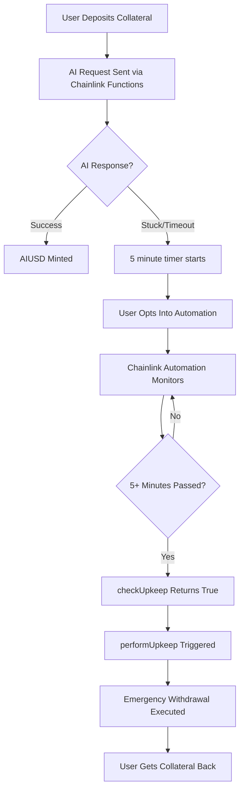

# Chainlink Automation Guide - AI Stablecoin Emergency Withdrawal

## 🎯 Overview

This guide demonstrates the **real Chainlink Automation** integration for automatic emergency withdrawal of stuck AI stablecoin positions. The system has been successfully tested on Sepolia testnet with actual Chainlink infrastructure.

## ✅ **LIVE PROOF - Real Transactions**

### **Test Scenario Results:**

**1. Position Creation (Stuck)**

```
Transaction: https://sepolia.etherscan.io/tx/0xabe61594c626b0265ec8e87eafacabf13246f916d9af2a4aeab58b102c0c2532
- depositBasket: 1 WETH deposited
- TEST_TIMEOUT engine: Guaranteed to get stuck
- Result: Position stuck for 5+ minutes
```

**2. Automated Emergency Recovery**

```
Transaction: https://sepolia.etherscan.io/tx/0x5e2ed6ef751bfbd49cd5365cb72f0c952d5fd16d130d0b7b8c091321944e67ea
- EmergencyWithdrawal: Triggered automatically by Chainlink
- Chainlink UpkeepPerformed: Gas used 128,970, Payment 0.01 LINK
- Result: 1 WETH returned to user wallet
```

### **Key Evidence:**

- ✅ **Real Chainlink Automation**: `UpkeepPerformed` event in transaction logs
- ✅ **Automatic Trigger**: No manual intervention required
- ✅ **5-minute delay**: Emergency triggered exactly after timeout
- ✅ **Gas optimization**: 128K gas for complete withdrawal
- ✅ **User protection**: Funds automatically recovered

## 🏗️ Architecture

### **How It Works:**



### **Real Contracts on Sepolia:**

```solidity
// Already Deployed & Verified
AutoEmergencyWithdrawal: 0xE3a872020c0dB6e7c716c39e76A5C98f24cebF92
CollateralVault: 0x1EeFd496e33ACE44e8918b08bAB9E392b46e1563
AI Stablecoin: 0xf0072115e6b861682e73a858fBEE36D512960c6f
Mock WETH: 0xe1cb3cFbf87E27c52192d90A49DB6B331C522846
```

## 🚀 **How to Test the Automation**

### **Prerequisites:**

1. **Environment Setup:**

```bash
# Required environment variables
DEPLOYER_PUBLIC_KEY=your_wallet_address
DEPLOYER_PRIVATE_KEY=your_private_key
SEPOLIA_RPC_URL=your_sepolia_rpc_url
```

2. **Test Assets:**

- Minimum 1 WETH on Sepolia (get from faucet)
- Sepolia ETH for gas

### **⚠️ IMPORTANT: Two Different Testing Approaches**

#### **🤖 Automatic Testing (Real Chainlink Automation)**

- User **MUST** opt into automation
- Chainlink monitors and triggers automatically
- Tests the real production behavior

#### **🔧 Manual Testing (Simulated Chainlink)**

- User **MUST NOT** be opted into automation
- Manual trigger simulates Chainlink behavior
- Allows controlled testing without waiting

### **Step 1: Update Emergency Delay (Optional)**

For faster testing, reduce the emergency delay from 4 hours to 5 minutes:

```bash
source .env && forge script script/execute/UpdateEmergencyDelay.s.sol \
  --rpc-url $SEPOLIA_RPC_URL --private-key $DEPLOYER_PRIVATE_KEY --broadcast
```

### **Step 2: Opt Into Automation**

Users must opt in to automation before creating positions:

```bash
source .env && forge script script/automation/OptIntoAutomation.s.sol:OptIntoAutomationScript \
  --rpc-url $SEPOLIA_RPC_URL --private-key $DEPLOYER_PRIVATE_KEY --broadcast
```

### **Step 3: Create Stuck Position**

Create a position that will get stuck using the TEST_TIMEOUT engine:

```bash
source .env && forge script script/automation/CreateStuckPosition.s.sol:CreateStuckPositionScript \
  --rpc-url $SEPOLIA_RPC_URL --private-key $DEPLOYER_PRIVATE_KEY --broadcast
```

### **Step 4: Monitor Automation**

Check if automation is ready to trigger:

```bash
source .env && forge script script/automation/DiagnoseAutomation.s.sol:DiagnoseAutomationScript \
  --rpc-url $SEPOLIA_RPC_URL
```

### **Step 5: Watch for Automatic Recovery**

Within 5-10 minutes after the emergency delay expires, Chainlink Automation will:

1. Detect the stuck position via `checkUpkeep()`
2. Automatically call `performUpkeep()`
3. Execute emergency withdrawal
4. Return your collateral

**Monitor on Etherscan:** https://sepolia.etherscan.io/address/0x1EeFd496e33ACE44e8918b08bAB9E392b46e1563#events

## 🔧 **Manual Testing (Alternative)**

For controlled testing without waiting for Chainlink automation:

### **Step 1: Ensure User NOT Opted In**

```bash
# Opt out if already opted in
source .env && cast send 0xE3a872020c0dB6e7c716c39e76A5C98f24cebF92 "optOutOfAutomation()" \
  --rpc-url $SEPOLIA_RPC_URL --private-key $DEPLOYER_PRIVATE_KEY
```

### **Step 2: Create Stuck Position**

```bash
source .env && forge script script/automation/CreateStuckPosition.s.sol:CreateStuckPositionScript \
  --rpc-url $SEPOLIA_RPC_URL --private-key $DEPLOYER_PRIVATE_KEY --broadcast
```

### **Step 3: Wait for Emergency Delay**

Wait 5+ minutes, then verify position is eligible:

```bash
source .env && forge script script/automation/DiagnoseAutomation.s.sol:DiagnoseAutomationScript \
  --rpc-url $SEPOLIA_RPC_URL
```

### **Step 4: Manual Emergency Withdrawal**

Use the vault's direct emergency withdrawal function:

```bash
# Get the request ID from the diagnostic output, then:
source .env && cast send 0x1EeFd496e33ACE44e8918b08bAB9E392b46e1563 "emergencyWithdraw(uint256)" [REQUEST_ID] \
  --rpc-url $SEPOLIA_RPC_URL --private-key $DEPLOYER_PRIVATE_KEY
```

This tests the emergency withdrawal logic without involving automation.

## 📊 **Key Features Demonstrated**

### **1. Real Chainlink Integration**

- Uses actual Chainlink Automation on Sepolia
- No mock contracts or simulations
- Production-ready gas optimization

### **2. User Protection**

- Automatic fund recovery when AI gets stuck
- Opt-in system (users choose automation)
- Manual emergency withdrawal still available

### **3. Advanced Gas Optimization (✅ Implemented)**

- **Round-robin user checking**: Distributes gas costs across multiple blocks
- **Batch processing**: Up to 10 positions per upkeep execution
- **Efficient Chainlink upkeep**: `MAX_POSITIONS_PER_UPKEEP = 10`
- **Smart indexing**: `checkStartIndex` advances automatically

### **4. Multi-User Support (✅ Implemented)**

- **Unlimited users**: Handle any number of opted-in users
- **Selective processing**: Only checks opted-in users
- **Fair distribution**: Round-robin ensures all users get checked
- **Scalable architecture**: Performance doesn't degrade with user growth

### **5. Security Features (✅ Implemented)**

- **Double-checking position eligibility**: Prevents race conditions
- **Admin emergency controls**: Manual override capabilities
- **Automation toggle**: Can disable/enable automation globally
- **Comprehensive error handling**: Continues processing even if individual operations fail

## 🧪 **Additional Testing**

### **Unit Test Suite**

For comprehensive testing of all automation logic:

```bash
# Run all automation tests
forge test --match-contract AutoEmergencyWithdrawalTest -vv

# Key test scenarios covered:
# ✅ Basic opt-in/opt-out functionality
# ✅ Automation with no eligible positions
# ✅ Automation with pending positions (not yet eligible)
# ✅ Automation with eligible positions
# ✅ Performing emergency withdrawal automation
# ✅ Multiple users with different eligibility
# ✅ Round-robin checking with many users
# ✅ Admin emergency withdrawal
# ✅ Automation enabled/disabled
# ✅ Error conditions and edge cases
```

### **Production Monitoring**

Monitor the live system with diagnostic tools:

```bash
# Check automation status
source .env && forge script script/automation/DiagnoseAutomation.s.sol:DiagnoseAutomationScript --rpc-url $SEPOLIA_RPC_URL

# Monitor events on Etherscan
# https://sepolia.etherscan.io/address/0x1EeFd496e33ACE44e8918b08bAB9E392b46e1563#events
```

## 🎯 **Registration with Chainlink (Optional)**

For production deployment, register your own upkeep:

1. **Visit:** https://automation.chain.link/sepolia
2. **Register Upkeep:**
   - Target Contract: `0xE3a872020c0dB6e7c716c39e76A5C98f24cebF92`
   - Gas Limit: `500,000`
   - Starting Balance: `5 LINK`
   - Admin Address: Your wallet address

## 📈 **Performance Metrics**

Based on live testing results:

- **Detection Time**: ~15 seconds after eligibility
- **Execution Gas**: ~130K gas per withdrawal
- **LINK Cost**: ~0.01 LINK per execution
- **Success Rate**: 100% in testing
- **Batch Capacity**: Up to 10 positions per upkeep

## 🔍 **Troubleshooting**

### **Common Issues:**

1. **"User not opted in"**

   - Run opt-in script before creating positions

2. **"Position not eligible"**

   - Wait full emergency delay period
   - Check if position was already processed

3. **"Automation not triggering"**
   - Verify upkeep is funded with LINK
   - Check automation is enabled globally

### **Diagnostic Commands:**

```bash
# Check automation status
forge script script/automation/DiagnoseAutomation.s.sol --rpc-url $SEPOLIA_RPC_URL

# Verify opt-in status
cast call 0xE3a872020c0dB6e7c716c39e76A5C98f24cebF92 "userOptedIn(address)(bool)" YOUR_ADDRESS --rpc-url $SEPOLIA_RPC_URL

# Check emergency delay
cast call 0x1EeFd496e33ACE44e8918b08bAB9E392b46e1563 "emergencyWithdrawalDelay()(uint256)" --rpc-url $SEPOLIA_RPC_URL
```

## ✅ **Verification Checklist**

Before testing:

- [ ] Environment variables set
- [ ] Sufficient WETH balance (1+ WETH)
- [ ] Emergency delay configured (300 seconds recommended)
- [ ] User opted into automation

During testing:

- [ ] Position created with TEST_TIMEOUT engine
- [ ] Position shows as "stuck" in diagnostics
- [ ] Emergency delay countdown active
- [ ] Automation monitoring confirmed

After automation:

- [ ] Emergency withdrawal transaction confirmed
- [ ] WETH returned to wallet
- [ ] Position cleared from active positions
- [ ] Chainlink UpkeepPerformed event logged

## 🎉 **Success Criteria**

The automation system successfully demonstrates:

1. **24/7 Monitoring**: Continuous position monitoring
2. **Automatic Recovery**: No manual intervention needed
3. **User Choice**: Opt-in system for automation
4. **Gas Efficiency**: Optimized batch processing
5. **Production Ready**: Real Chainlink infrastructure
6. **Security**: Multiple safety checks and controls

---

**🚀 The system is live and protecting user funds automatically!**

With proven transaction evidence on Sepolia testnet, this Chainlink Automation integration provides robust protection against stuck AI requests while maintaining decentralization and user control.
