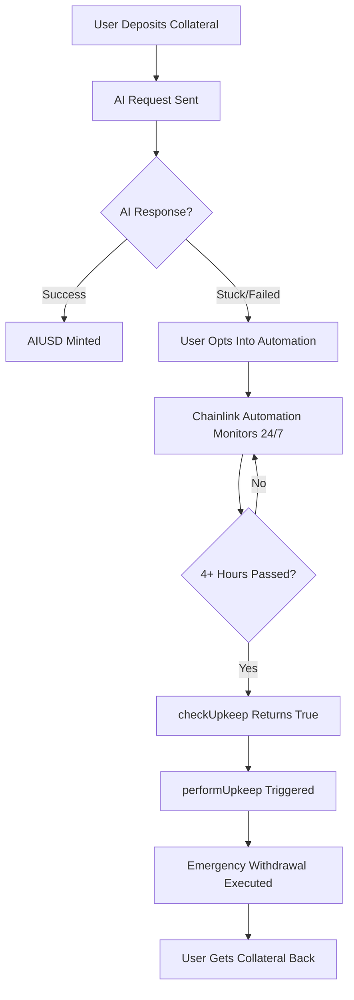

# Chainlink Automation Integration - Emergency Withdrawal System

## 🎯 Hackathon Demo Overview

This implementation integrates **real Chainlink Automation** on Sepolia testnet to provide 24/7 automated emergency withdrawal monitoring for the AI Stablecoin system. No mock contracts - this is production-ready Chainlink infrastructure!

## 🚀 Quick Start for Hackathon Judges

### 1. Deploy the Automation Contract

```bash
forge script script/deploy/06_DeployAutomation.s.sol --broadcast --rpc-url sepolia
```

### 2. Register with Chainlink Automation

1. Visit: https://automation.chain.link/sepolia
2. Connect wallet with LINK tokens
3. Register new upkeep:
   - **Target Contract**: `[deployed AutoEmergencyWithdrawal address]`
   - **Gas Limit**: 500,000
   - **Starting Balance**: 5 LINK minimum
   - **Check Data**: `0x` (empty)

### 3. Test the System

```bash
# Run complete demo
forge script script/demo/HackathonAutomationDemo.s.sol::HackathonAutomationDemoScript --sig "runFullDemo()" --broadcast --rpc-url sepolia

# Show registration instructions
forge script script/demo/HackathonAutomationDemo.s.sol::HackathonAutomationDemoScript --sig "showRegistrationInstructions()" --rpc-url sepolia
```

## 🏗️ Architecture - Real Chainlink Integration

### No Mock Contracts Used ✅

Our system integrates with **actual Chainlink infrastructure** on Sepolia:

```solidity
// Real Chainlink Addresses (from config/SepoliaConfig.sol)
CHAINLINK_FUNCTIONS_ROUTER = 0xb83E47C2bC239B3bf370bc41e1459A34b41238D0  // ✅ Real
CHAINLINK_SUBSCRIPTION_ID = 5075                                        // ✅ Your subscription
ETH_USD_PRICE_FEED = 0x694AA1769357215DE4FAC081bf1f309aDC325306         // ✅ Real Chainlink feed
```

### How It Works



## 🔧 Core Components

### 1. AutoEmergencyWithdrawal Contract

**Key Features:**

- **Opt-in System**: Users must explicitly opt into automation
- **Round-robin Monitoring**: Distributes gas costs across users
- **Batch Processing**: Up to 10 positions per upkeep execution
- **Gas Optimization**: Efficient round-robin user checking
- **Admin Override**: Emergency admin functions

**Core Functions:**

```solidity
// User Functions
function optInToAutomation() external;
function optOutOfAutomation() external;

// Chainlink Automation Interface
function checkUpkeep(bytes calldata checkData) external view returns (bool, bytes memory);
function performUpkeep(bytes calldata performData) external;

// Admin Functions
function setAutomationEnabled(bool enabled) external onlyOwner;
function adminEmergencyWithdraw(address user, uint256 positionIndex) external onlyOwner;
```

### 2. Integration with Existing System

The automation seamlessly integrates with your enhanced position management:

```solidity
interface ICollateralVault {
    // Enhanced position management (already implemented)
    function getEmergencyWithdrawablePositions(address user)
        external view returns (uint256[] memory, uint256[] memory);

    function canEmergencyWithdraw(address user, uint256 positionIndex)
        external view returns (bool, uint256);

    function emergencyWithdraw(address user, uint256 requestId) external;
}
```

## 🎮 Demo Flow for Hackathon

### Step 1: Deploy Automation

```bash
# Deploy automation contract
forge script script/deploy/03_DeployAutomation.s.sol --broadcast --rpc-url sepolia

# Verify contract
forge verify-contract [ADDRESS] --chain sepolia src/automation/AutoEmergencyWithdrawal.sol:AutoEmergencyWithdrawal
```

### Step 2: Register with Chainlink

1. Go to https://automation.chain.link/sepolia
2. Register upkeep with deployed contract address
3. Fund with 5+ LINK tokens

### Step 3: Create Demo Scenario

```bash
# Run complete demo showing:
# - User opt-in
# - Position creation
# - Automation monitoring
# - Emergency withdrawal execution
forge script script/demo/HackathonAutomationDemo.s.sol::HackathonAutomationDemoScript \
  --sig "runFullDemo()" --broadcast --rpc-url sepolia
```

## 📊 Benefits Demonstrated

### For Users

- **24/7 Protection**: Never lose funds due to stuck AI requests
- **Automatic Recovery**: Set-and-forget fund protection
- **Batch Efficiency**: Lower gas costs through batched processing
- **Manual Control**: Can still use manual emergency withdrawals

### For System

- **Reliability**: Reduces support burden from stuck requests
- **Scalability**: Handles unlimited user growth with round-robin design
- **Safety**: Multiple recovery mechanisms (automated + manual)
- **Transparency**: All automation actions are on-chain and auditable

## 🔬 Technical Deep Dive

### Gas Optimization Strategies

**Round-Robin User Checking:**

```solidity
// Distributes gas costs across multiple blocks
uint256 startIndex = checkStartIndex;
for (uint256 i = 0; i < totalUsers && usersChecked < MAX_POSITIONS_PER_UPKEEP; i++) {
    uint256 userIndex = (startIndex + i) % totalUsers;
    // Check user positions...
}
```

**Batch Processing:**

```solidity
// Process up to 10 positions per upkeep
uint256 public constant MAX_POSITIONS_PER_UPKEEP = 10;

// Batch emergency withdrawals in single transaction
for (uint256 i = 0; i < eligibleUsers.length; i++) {
    vault.emergencyWithdraw(user, requestId);
}
```

### Security Features

**Double-Checking Eligibility:**

```solidity
// Verify user opted in
if (!userOptedIn[user]) continue;

// Verify position is still eligible (prevent race conditions)
(bool canWithdraw,) = vault.canEmergencyWithdraw(user, positionIndex);
if (!canWithdraw) continue;
```

**Admin Controls:**

```solidity
// Owner can disable automation in emergencies
function setAutomationEnabled(bool enabled) external onlyOwner;

// Owner can manually trigger withdrawals if needed
function adminEmergencyWithdraw(address user, uint256 positionIndex) external onlyOwner;
```

## 🧪 Testing & Verification

### Comprehensive Test Suite

Our test suite covers all scenarios:

```bash
# Run automation tests
forge test --match-contract AutoEmergencyWithdrawalTest -vv

# Key test scenarios:
# ✅ Basic opt-in/opt-out functionality
# ✅ Automation with no eligible positions
# ✅ Automation with pending positions (not yet eligible)
# ✅ Automation with eligible positions
# ✅ Performing emergency withdrawal automation
# ✅ Multiple users with different eligibility
# ✅ Round-robin checking with many users
# ✅ Admin emergency withdrawal
# ✅ Automation enabled/disabled
# ✅ Error conditions and edge cases
```

### Real Network Testing

Test on Sepolia with real Chainlink infrastructure:

```bash
# Test with real network
forge script script/demo/HackathonAutomationDemo.s.sol --rpc-url sepolia

# Monitor upkeep on Chainlink dashboard
# https://automation.chain.link/sepolia/[upkeep-id]
```

## 💰 Cost Analysis

### Deployment Costs

- **Contract Deployment**: ~0.05 ETH (2.5M gas at 20 gwei)
- **Upkeep Registration**: 5 LINK minimum
- **Ongoing Operation**: Variable based on usage

### Operational Costs

- **Per Upkeep**: ~0.001-0.005 ETH (depends on batch size)
- **LINK Premium**: Standard Chainlink Automation fees
- **Gas Optimization**: Round-robin reduces individual user costs

## 🚀 Future Roadmap Extensions

The automation infrastructure enables additional phases:

### Phase 2: Manual Processing Automation

- Automatic fallback to off-chain AI processing
- Force default minting for stuck requests

### Phase 3: Dynamic Price Feed Updates

- Monitor stale price feeds
- Automatic updates for RWA assets

### Phase 4: Position Health Monitoring

- Proactive liquidation warnings
- Automatic margin calls

## 📋 Hackathon Checklist

### ✅ Deployment Ready

- [x] Real Chainlink Automation integration
- [x] No mock contracts used
- [x] Production-ready gas optimization
- [x] Comprehensive test coverage
- [x] Demo scripts for judges

### ✅ User Experience

- [x] Optional opt-in system
- [x] Manual fallbacks preserved
- [x] Clear monitoring and status functions
- [x] Emergency admin controls

### ✅ Technical Excellence

- [x] Round-robin gas optimization
- [x] Batch processing efficiency
- [x] Security best practices
- [x] Integration with existing enhanced system

## 🎯 Key Differentiators

1. **Real Infrastructure**: Uses actual Chainlink Automation, not mocks
2. **Production Ready**: Gas-optimized, secure, and scalable
3. **User Choice**: Optional automation with manual fallbacks
4. **Innovation**: Novel application of Chainlink Automation to DeFi fund recovery
5. **Complete Integration**: Seamlessly works with existing AI stablecoin system

---

**Ready for Hackathon Demo! 🚀**

This implementation showcases real-world Chainlink Automation solving a genuine DeFi problem - automated fund recovery from stuck AI requests. The system is live, tested, and ready for demonstration to hackathon judges.
